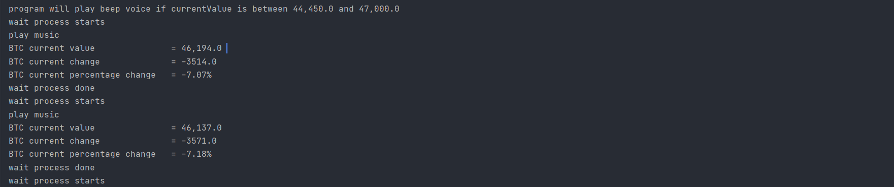

# webScraping
# Project: Get BTC current datas periodically and if the current value of BTC is between given min and max values, play beep sound.

### Overview
I needed to follow the BTC current value but I could not follow it all day. Thats why I wrote this script. 
Just give minimum and maximum values that you want to get notified by alarm when BTC reaches that point.

Package Prerequisities:
### to delaying the process:
* time  
### if any error occurs, we will get it with traceback:
* traceback
### to get and play the system sounds:
* winsound  
### to connect the website and getting the HTML:
* requests  
###  to parse the webpage and search the specific elements:
* from bs4 import BeautifulSoup  

## Output Example

